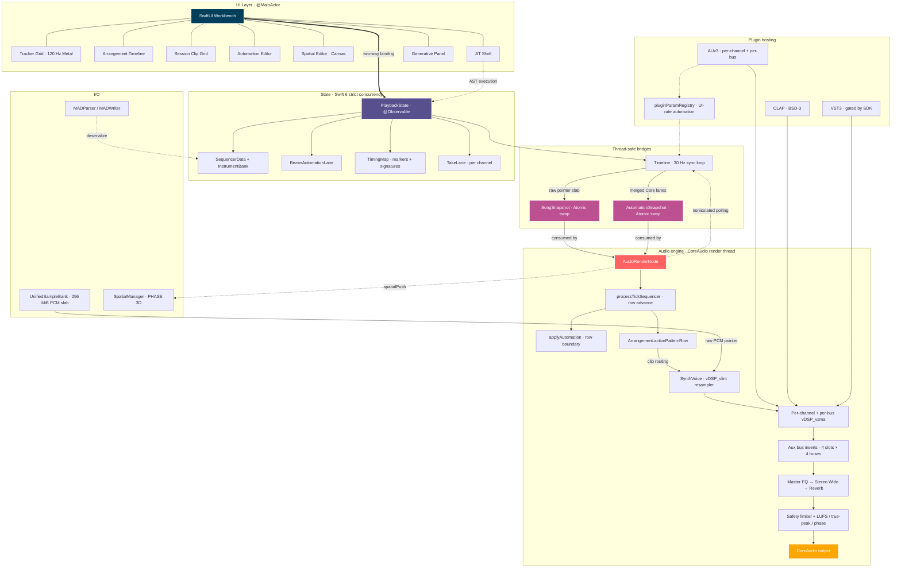

# ToooT — Open-source macOS DAW

**ToooT** is a high-performance Digital Audio Workstation for **macOS 15+** on **Apple Silicon**. Built entirely in **Swift 6** with strict concurrency, it pairs three composition paradigms — classic tracker grid, linear arrangement, Ableton-style session grid — against a zero-allocation audio engine, AUv3 / CLAP / VST3 plugin hosting, mastering-grade metering, and a procedural composition shell.


---

## Features & Capabilities

Project ToooT isn't just a traditional sequencer; it's a modern workstation designed around speed, hardware acceleration, and algorithmic intelligence.

### Audio engine
- **Zero-allocation render thread**: `ToooT_Core` runs on a strictly C-pointer-backed render loop. No Swift arrays, dictionaries, or object allocations happen on the audio thread.
- **Vectorized DSP**: every math operation routes through `vDSP` / Accelerate — Hermite resampling, volume ramping (`vDSP_vrampmul`), summing — easily supporting 256+ concurrent channels.
- **Multi-core offline render**: `renderOfflineConcurrent` parallelizes voice processing across cores with a per-voice scratch pool. Drives `exportAudio` bounces. Bit-exact-modulo-fp-reorder parity with the serial path verified by UAT 53 (max diff ≤ 1e-7).
- **Plugin delay compensation**: sample-accurate per-channel delay so tracks stay phase-aligned through heavy AUv3 chains.
- **Variable sample rate**: 44.1 / 48 / 88.2 / 96 / 192 kHz threaded end-to-end through the render block, voices, metering, and export.

### Three composition paradigms

- **Tracker grid** — classic ProTracker / FastTracker / Impulse Tracker workflow. 120 Hz Metal-rendered pattern view with GPU instancing for thousands of scrolling cells.
- **Linear arrangement** — Pro Tools / Logic / Reaper paradigm. Drag pattern clips onto a horizontal timeline; the engine reads from clips when an arrangement is loaded, falling back to pattern-grid playback otherwise.
- **Session grid** — Ableton-style clip-launch grid for live performance + sketching.

### Automation
- **Render-path engine automation** — atomic `AutomationSnapshot` swap on the audio thread, evaluated at every row boundary. Targets: `master.volume`, `tempo.bpm`, per-channel volume / pan / send, per-bus volume.
- **Plugin parameter automation** — every loaded AUv3 plugin's parameter tree is registered automatically (`plugin.<channel>.<slot>.<address>`); evaluated at UI tick rate via `AUParameter.setValue` (documented thread-safe).
- **Three-pane editor** — sidebar lists every available target with a status dot per active lane; gridded canvas with bar lines + value markers + curve fill; point inspector with linear / S-curve picker + delete. Click empty space to insert a point, drag to move, click a point to select.

### Tempo, markers, time signatures
- **Tempo automation** — write through the `tempo.bpm` target; engine clamps to [20, 999] at row boundaries.
- **Markers** — named cue points (Verse / Drop / Bridge); `seekToMarker(named:)` jumps the playhead.
- **Time signatures** — multiple signature changes per project, persisted in the `.mad` `TOOO` chunk. Mid-song meter consumption by the render path is in progress.

### Recording
- **Take lanes** — per channel; `RecordingMode { replace, overdub, loop }`. Replace clears prior takes; overdub stacks new ones; loop captures successive passes through a region. Latest take is the active one; `setActive(takeID:)` switches between layered takes for comping.

### ToooTShell JIT — procedural composition
Integrated floating console for code-driven composition:
- **Generative rhythms**: Euclidean (`euclid`) or TidalCycles-style (`tidal`) drum patterns.
- **Algorithmic transforms**: `humanize` (randomize velocity/timing), `evolve` (procedural note mutations), `reverse`, `shuffle`.
- **Bulk editing**: `fill` for step-sequencing, `arp` for arpeggios, `fade` for velocity ramps.
- **Custom macros**: chain commands (`macro build = copy 1 2; fade 2 out`).

### Generative panel
SwiftUI panel for procedural composition without the JIT shell:
- **8 generators** — Markov Melody / Euclidean Beat / L-System Arp / Harmony Layer / Bassline / Drum Pattern / Chord Progression / Variation.
- **Style picker** — Techno / Drum & Bass / Ambient / Hip-Hop / Jazz / Breakbeat (each shapes the drum pattern generator).
- **Music theory controls** — 12 chromatic keys, 8 scales (major / minor / dorian / phrygian / lydian / mixolydian / pentatonic / blues).
- **Intensity + complexity sliders** — control density per generator.
- **Three flavor tiers** — *Studio* (clean, classic), *Organic* (humanized timing + breath), *Generative* (stochastic / glitchy / experimental).

### Waveform editor
- **Non-destructive DSP**: normalize, reverse, silence, crop, resample, crossfade-looping directly on PCM data.
- **Instant undo buffer**: every DSP edit snapshots into memory; rollback with one click.
- **Harmonic generation**: draw directly onto the spectral canvas or trace imported images to generate wavetables.

### Spatial audio
- **PHASE 3D engine** — Apple's Physical Audio Spatialization Engine drives the actual 3D mix.
- **Top-down spatial editor** — SwiftUI Canvas view: listener at center, draggable channel dots around them. Angle = panning, distance = attenuation, dot size = volume. Distance rings at 1 m / 2 m / 4 m / 8 m, cardinal cross + Front/Back/L/R labels. Hover any channel for live position + volume readout.

### Plugin hosting
- **AUv3** — per-channel insert chains (4 inserts + 1 instrument) plus per-bus insert chains on every aux bus, plus a master insert slot for the linear-phase EQ.
- **CLAP** — BSD-3-licensed; full discovery, load, real-time process. u-he / FabFilter / Surge XT verified.
- **VST3** — direct Objective-C++ bridge against the Steinberg SDK. No JUCE.
- **Plugin scan deferred off cold-launch path** — `AUv3HostManager.discoverPluginsAsync()` runs on a detached utility Task; main thread isn't blocked while `AVAudioUnitComponentManager` enumerates.

### Mixing + mastering chain
- **Mixer console** — `StudioKnob` + `StudioFader` widgets, virtualized for high channel counts.
- **Linear-phase EQ in the master chain** — 10 log-spaced bands (31 Hz – 16 kHz), 4096-point overlap-save FFT convolution. Order: EQ → stereo widen → reverb → safety limiter.
- **True-peak limiter** — 4× inter-sample peak detection, 64-sample look-ahead, dBTP ceiling.
- **Multiband compressor** — 3-band Linkwitz-Riley.
- **ITU-R BS.1770-4 LUFS metering** — momentary / short-term / gated integrated.
- **Sidechain ducking** — real-time global routing for compression "pumping" effects.
- **TPDF dither + loudness-normalized export** — Spotify / Apple Music / YouTube / EBU R128 targets.

### Format compatibility
- **Lossless `.mad`** — native chunk-based file format. Preserves DSP state, AUv3 / VST3 plugin state, scenes, arrangements, session grids, automation, markers, time signatures, take lanes.
- **Retro tracker support** — `.mod`, `.xm`, `.it`, `.s3m` load + play.
- **Universal drag-and-drop** — drop a sample or project file anywhere in the workbench.
- **Video sync** — load `.mp4` / `.mov` to follow your composition; `VideoSyncModel` corrects drift > 1 frame.
- **Quick Look + Spotlight primitives** — `MADMetadataReader` + `MADThumbnail` ship pure-Foundation extractors ready to drop into a Quick Look `.appex` or Spotlight `.mdimporter`. Recipes in [docs/MAD_QUICKLOOK_SPOTLIGHT.md](docs/MAD_QUICKLOOK_SPOTLIGHT.md).

### macOS native integration
- **AppIntents (Shortcuts.app)** — Open Project / Open Last Autosave / New Project intents discoverable from Spotlight and the Shortcuts gallery.
- **Auto-save + crash recovery** — 60 s autosave cadence, rolling 10-file per-title window. On launch, recent autosaves surface in a recovery sheet for one-click restore.
- **Document type registration** — Finder double-click on `.mad` opens ToooT (UTI declared in `Info.plist`).
- **Keyboard shortcuts** — preset modes (ToooT / Pro Tools / Logic), customizable bindings, persisted via `UserDefaults`.
- **Command palette** — ⌘K fuzzy finder over every shipped command.
- **Undo history browser** — 50-step stack with descriptive labels, jump-to-step.
- **Cold-launch instrumentation** — `os_signpost` intervals on EngineBoot / InternalDSPBoot / OutputUnitBoot under subsystem `com.apple.ProjectToooT` / category `ColdLaunch`.

---

## Architecture

ToooT separates the audio thread (zero-allocation, lock-free) from the UI thread (SwiftUI `@Observable`) via two atomic snapshot bridges — one for song data, one for automation lanes. Every cross-thread mutation goes through them.



### Module breakdown

- **`ToooT_Core`** — zero-allocation render loop: `AudioRenderNode`, `SynthVoice`, `RenderResources`, the two atomic-snapshot bridges (`SongSnapshot`, `AutomationSnapshot`), `EngineSharedState`, `AtomicRingBuffer`, `UnifiedSampleBank`, `MasterMeter` (LUFS / true-peak / phase correlation), `MusicTheory`, `Arpeggiator`, `Arrangement` (with engine consumption), `SessionGrid`, `Automation`, `Scenes`, `Markers` + `TimingMap`, `RecordingTake` + `TakeLane`, `Fuzzer`, `StabilityMonitor`.
- **`ToooT_UI`** — SwiftUI frontend: tracker grid (Metal 120 Hz), mixer, JIT console, waveform editor, arrangement timeline, session clip grid, three-pane automation editor, spatial editor (Canvas), generative panel, command palette, undo-history browser, crash-recovery sheet, video sync, JS scripting host, TTS via `AVSpeechSynthesizer`. Also `AudioHost` (engine wiring, plugin lifecycle, AUv3 parameter registry) and `Timeline` (MainActor 30 Hz sync loop).
- **`ToooT_IO`** — `MADParser` / `MADWriter`, `MIDI2Manager` (MIDI 2.0 UMP + MPE dispatch), `SpatialManager` (PHASE 3D), `MADMetadataReader` + `MADThumbnail` (Quick Look / Spotlight extractors).
- **`ToooT_Plugins`** — AUv3 hosting + bundled DSP (`ReverbPlugin`, `StereoWidePlugin`, `TruePeakLimiter`, `MultibandCompressor`, `LinearPhaseEQ`) + `MasteringExport` (TPDF dither + LUFS normalize) + `OfflineDSP` + `GPU_DSP` (Metal compute kernels).
- **`ToooT_VST3`** — Objective-C++ bridge linking directly against Steinberg's VST3 SDK. No JUCE.
- **`ToooT_CLAP` / `ToooT_CLAP_C`** — BSD-3-Clause CLAP plugin host. BSD-licensed ABI vendored; C loader wraps `dlopen` on `.clap` bundles; Swift layer manages instance lifecycle.

---

## Building and Running

**Requirements:**
- Xcode 16.0+ (macOS 15+)
- Apple Silicon (M-series processor recommended)

```bash
# Clone the repository
git clone https://github.com/mstits/Tooot.git
cd Tooot

# Build via Swift Package Manager
swift build

# Package the application bundle
./bundle.sh

# Run the app
open ToooT.app
```

---

## Testing

The repository includes a 270+ assertion User Acceptance Testing (UAT) suite covering the audio engine, mastering chain (including linear-phase EQ activation), plugin hosting, mixer routing, MIDI 2.0 / MPE dispatch, automation evaluator (engine + plugin params + tempo + markers), arrangement engine consumption, snapshot lifecycle (concurrent stress + leak verification), and a multi-second A/B comparison against `openmpt123` for tracker-format fidelity. Concurrent / serial render parity is asserted bit-exact-modulo-fp-reorder.

```bash
swift build && .build/arm64-apple-macosx/debug/UATRunner
```

A separate fuzz runner feeds random bytes at the parsers (`MADParser`, MIDI UMP, `FormatTranspiler`) and a stress runner exercises the engine under sustained load:

```bash
.build/arm64-apple-macosx/debug/FuzzRunner
.build/arm64-apple-macosx/debug/StressRunner
```

---

## Documentation

Deeper reading in `docs/`:

- [ARCHITECTURE.md](docs/ARCHITECTURE.md) — module graph, thread model, render pipeline, snapshot lifecycle, memory ownership.
- [FEATURE_ROADMAP.md](docs/FEATURE_ROADMAP.md) — honest assessment of what ships today vs what pro DAWs offer; current state of every roadmap item.
- [TUTORIAL.md](docs/TUTORIAL.md) — first-session walkthrough.
- [MAD_FORMAT.md](docs/MAD_FORMAT.md) — `.mad` file layout, instrument header, plugin-state trailer, round-trip guarantees.
- [MAD_QUICKLOOK_SPOTLIGHT.md](docs/MAD_QUICKLOOK_SPOTLIGHT.md) — recipes for wrapping the Quick Look `.appex` and Spotlight `.mdimporter` extensions in Xcode.
- [JIT_SHELL.md](docs/JIT_SHELL.md) — ToooTShell command reference and macro system.
- [PLUGINS.md](docs/PLUGINS.md) — AUv3 hosting contract, bundled effects, VST3 status and enablement steps.

For release-by-release changes, see [CHANGELOG.md](CHANGELOG.md).

## License

This project is licensed under the MIT License - see the [LICENSE](LICENSE) file for details.
