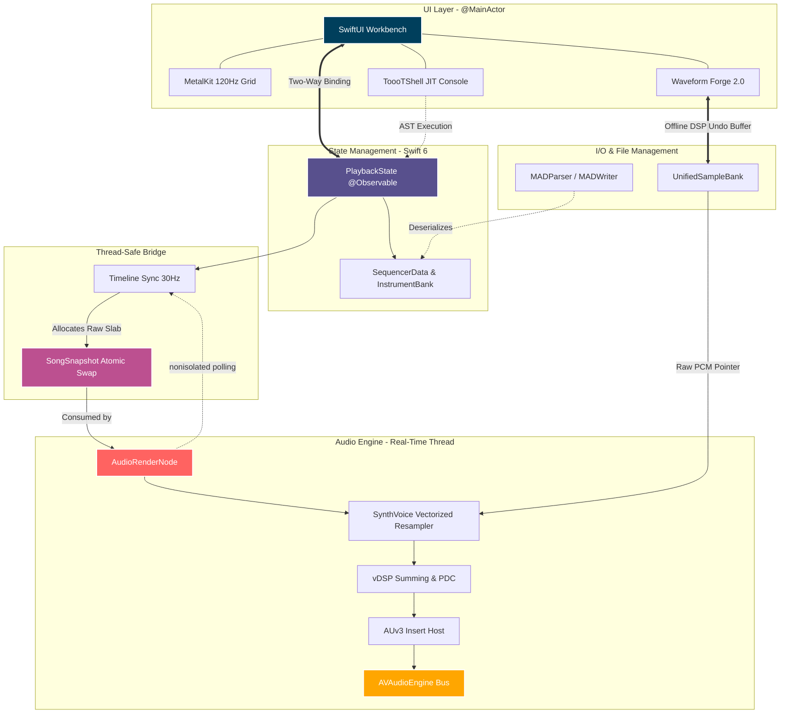

# Project ToooT — A macOS Native Audio Workstation

**Project ToooT** is a cutting-edge, high-performance Digital Audio Workstation (DAW) engineered specifically for **macOS 16** and **Apple Silicon**. Built entirely in **Swift 6** with strict concurrency, it bridges the gap between classic tracker-based music composition and modern, procedural audio production.


---

## Features & Capabilities

Project ToooT isn't just a traditional sequencer; it's a modern workstation designed around speed, hardware acceleration, and algorithmic intelligence.

### Blazing Fast Audio Engine
- **Zero-Allocation Render Thread**: The `ToooT_Core` audio engine runs on a strictly C-pointer-backed render loop. No Swift arrays, dictionaries, or object allocations happen on the audio thread.
- **100% Vectorized DSP**: Leverages Apple's `vDSP` and Accelerate frameworks for all math operations—from Hermite resampling to volume ramping (`vDSP_vrampmul`) and mixing, easily supporting 256+ concurrent channels.
- **Plugin Delay Compensation (PDC)**: Sample-accurate delay compensation ensures your tracks remain perfectly phase-aligned, even when routing through heavy AUv3 effect chains.

### Metal GPU Accelerated UI
- **120Hz Pattern Grid**: The core tracker sequencer is rendered natively using `MetalKit`. By utilizing GPU instancing, ToooT handles thousands of scrolling note cells with zero CPU overhead and ultra-low UI latency.
- **Industrial "Glassmorphism" Design**: A sleek, high-density professional UI built with SwiftUI, utilizing advanced Material effects and MeshGradients.

### ToooTShell JIT 3.0 (Procedural Composition)
A massive departure from traditional DAWs, ToooT features a fully integrated floating programming console for rapid, code-driven composition:
- **Generative Rhythms**: Instantly create Euclidean (`euclid`) or TidalCycles-style (`tidal`) drum patterns.
- **Algorithmic Transforms**: Highlight a track and apply commands like `humanize` (randomize velocity/timing), `evolve` (procedural note mutations), `reverse`, or `shuffle`.
- **Bulk Editing**: Use commands like `fill` for instant step-sequencing, `arp` for generating complex arpeggios, and `fade` for velocity ramps.
- **Custom Macros**: Define and trigger custom multi-command sequences (e.g., `macro build = copy 1 2; fade 2 out`) to automate your entire workflow.

### Waveform Forge 2.0
A dedicated, edge-to-edge floating window for precision sample manipulation.
- **Non-Destructive DSP**: Perform operations like Normalize, Reverse, Silence, Crop, Resample, and Crossfade-Looping directly on the PCM data.
- **Instant Undo Buffer**: Every DSP edit is instantly snapshotted into memory, allowing you to confidently experiment with waveform manipulation and rollback with a single click.
- **Harmonic Generation**: Draw directly onto the Spectral Canvas or trace imported images to procedurally generate custom wavetables.

### PHASE Spatial 3D Engine
Move beyond stereo panning. ToooT integrates Apple's native PHASE (Physical Audio Spatialization Engine):
- Map your 2D tracker channels into a fully immersive 3D spatial field.
- Drag and drop audio sources in a 3D visualizer to dynamically route audio positions, taking full advantage of macOS spatial audio rendering.

### Neural Intelligence Core
Post-human generative algorithms built directly into the UI:
- **Markov Melodies**: Train transition matrices on your existing sequences to predict and generate mathematically similar, endlessly evolving melodies.
- **L-System Arpeggios**: Generate fractal, organic note sequences based on biological growth algorithms.
- **Synthesis Tiers**: Tweak high-level algorithmic parameters like "Corruption," "Arrhythmia," and "Fractal Dimension" to introduce controlled chaos.

### Professional Mixing & AUv3 Hosting
- **Studio Console**: A virtualized, high-performance mixing console with custom `StudioKnob` and `StudioFader` widgets.
- **AUv3 Plugin Support**: Host external Apple Audio Units on any channel. Presets and opaque plugin states are fully serialized and saved directly into your `.mad` project files.
- **Vectorized Automation**: Draw complex Bezier curves for volume, panning, and pitch.

### Universal Format Compatibility
- **Lossless `.mad` Format**: Native chunk-based file format that perfectly preserves all high-resolution DSP, AUv3 states, and automation.
- **Retro Support**: Flawless loading and playback of classic `.mod`, `.xm`, `.it`, and `.s3m` tracker formats.
- **Video Sync**: Load `.mp4` or `.mov` files to perfectly synchronize your composition to a video timecode for scoring and sound design.

---

## Architecture

Project ToooT is built on a **Reactive-Pull Engine** pattern. The frontend leverages modern `SwiftUI` observation, communicating with a highly-optimized, C-pointer-backed Core Audio render loop.



### Module Breakdown

- **`ToooT_Core`**: The beating heart of the DAW. Contains the zero-allocation `AudioRenderNode`, pattern sequencer, envelope evaluators, and atomic data structures.
- **`ToooT_UI`**: The modern, industrial "glassmorphism" SwiftUI frontend. Houses the GPU-accelerated pattern grid, the mixer, the JIT console, and the waveform editor.
- **`ToooT_IO`**: Custom parsers (`MADParser`, `MADWriter`) providing bit-perfect backwards compatibility.
- **`ToooT_Plugins`**: The AUv3 hosting layer.

---

## Building and Running

**Requirements:**
- Xcode 16.0+ (macOS 15+)
- Apple Silicon (M-series processor recommended)

```bash
# Clone the repository
git clone https://github.com/mstits/Tooot.git
cd Tooot

# Build via Swift Package Manager
swift build

# Package the application bundle
./bundle.sh

# Run the app
open ToooT.app
```

---

## Testing

The repository includes an extensive 100+ assertion User Acceptance Testing (UAT) suite that validates the audio engine, UI transport synchronization, and DSP memory safety.

```bash
swift build && .build/arm64-apple-macosx/debug/UATRunner
```

---

## License

This project is licensed under the MIT License - see the [LICENSE](LICENSE) file for details.
