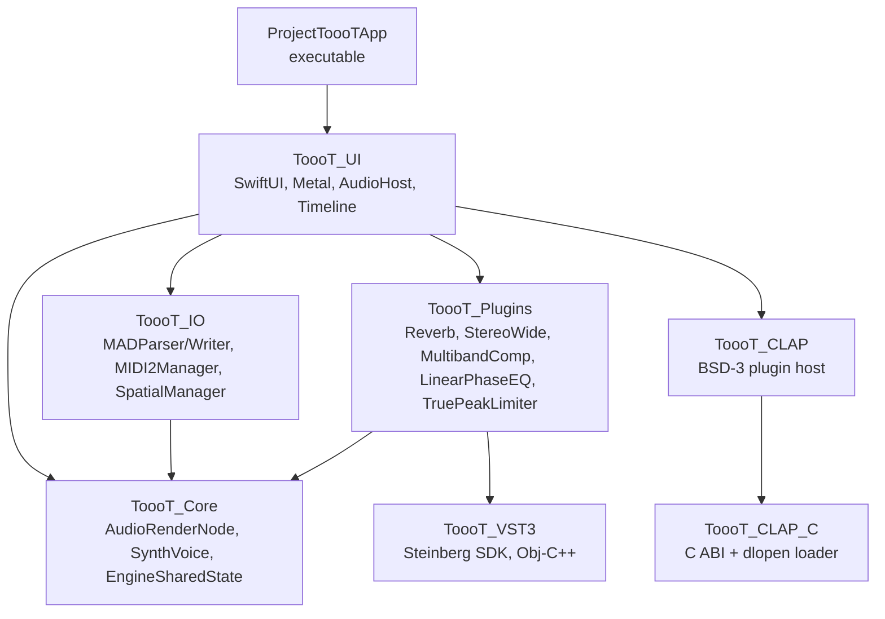
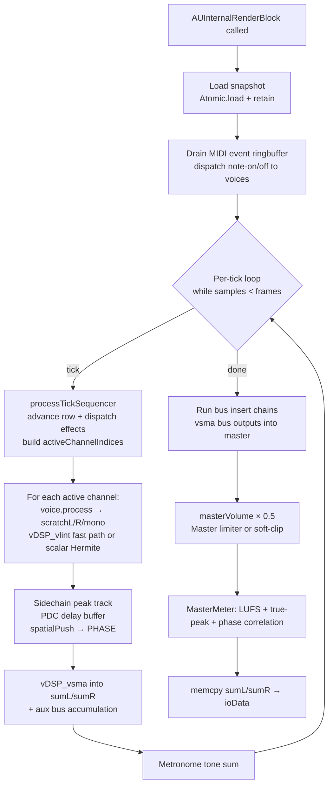
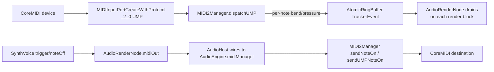
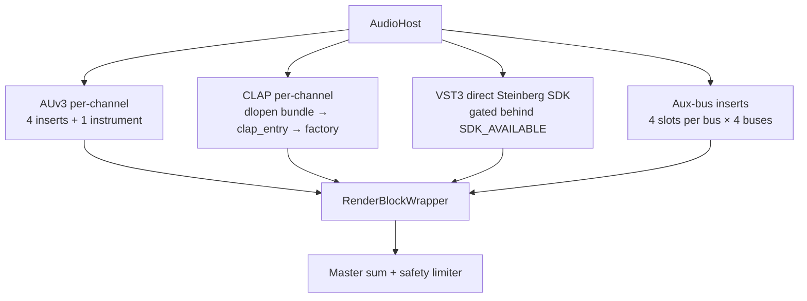

# ToooT Architecture

## Module graph



| Module | Role |
|---|---|
| `ToooT_Core` | Zero-allocation render loop: `AudioRenderNode`, `SynthVoice`, `RenderResources`, atomic snapshot bridge, `EngineSharedState`, `AtomicRingBuffer`, `UnifiedSampleBank`, `MasterMeter`, music theory + arrangement + session models. |
| `ToooT_IO` | Parsers / writers (`MADParser`, `MADWriter`, `FormatTranspiler`), `MIDI2Manager` (UMP in+out, MPE dispatch, clock), `SpatialManager` (PHASE). |
| `ToooT_Plugins` | Bundled DSP units: `ReverbPlugin`, `StereoWidePlugin`, `TruePeakLimiter`, `MultibandCompressor`, `LinearPhaseEQ`, `MasteringExport`, `AUv3HostManager`, `OfflineDSP` + `GPU_DSP`. |
| `ToooT_VST3` | Obj-C++ bridge that links directly against Steinberg's VST3 SDK. Gated behind `TOOOT_VST3_SDK_AVAILABLE`. |
| `ToooT_CLAP` / `ToooT_CLAP_C` | BSD-3-Clause CLAP host. `_C` carries the minimal ABI header + dlopen loader; the Swift side does discovery + instance management. |
| `ToooT_UI` | SwiftUI workbench, Metal pattern grid, Piano Roll, arrangement + session views, JIT shell, `AudioHost` (engine wiring), `Timeline` (MainActor sync loop). |

## Thread model

Three threads are load-bearing:

| Thread | Actor / isolation | Rules |
|---|---|---|
| Audio I/O (CoreAudio) | `nonisolated` — entered via `renderBlock` | No heap allocation, no locking, no Swift ARC traffic, no `@MainActor` calls. Reads snapshot via a single `Atomic<UInt>` exchange. |
| UI | `@MainActor` | Never dereferences audio-thread pointers directly. Reads playback state via `EngineSharedState` snapshot fields written by the render thread (naturally atomic on arm64 aligned word stores). |
| Background | default actor | MIDI clock timer (`DispatchSource.userInteractive`), recording tap drain, async export, autosave. |

The single legal write path from UI to engine is `AudioRenderNode.swapSnapshot(_:SongSnapshot)`, which performs an atomic pointer exchange and queues the old snapshot for main-thread deallocation via `processDeallocations`.

## Render pipeline (per audio buffer)



`RenderBlockWrapper` (in `AudioHost.swift`) wraps `renderBlock` with per-channel AUv3 insert chains (4 per channel + 1 instrument slot), per-bus AUv3 insert chains (4 per bus), then the global StereoWide + Reverb inserts.

## Snapshot lifecycle

`SongSnapshot` is a value type with raw pointers into `SequencerData`. `SnapshotBox` wraps it so Unmanaged retain/release can be used. `_snapshotPtr: Atomic<UInt>` holds the bitPattern of the current box.

```mermaid
sequenceDiagram
    participant UI as UI thread
    participant Atomic as _snapshotPtr<br/>(Atomic&lt;UInt&gt;)
    participant Queue as deallocationQueue
    participant Audio as Audio thread

    UI->>UI: Build new SongSnapshot + SnapshotBox
    UI->>Atomic: exchange(new raw pointer)
    Atomic-->>UI: returns old raw pointer
    UI->>Queue: push(old)
    Audio->>Atomic: load (acquire)
    Atomic-->>Audio: current raw
    Audio->>Audio: retain → process block → release
    UI->>Queue: processDeallocations()<br/>release old box
```

## Memory ownership

- `UnifiedSampleBank` owns one giant PCM slab (256 MiB default). Samples have no per-region retain count; `SampleRegion.offset+length` indexes the slab.
- `RenderResources` owns all render-thread scratch buffers (per-channel delay, voices, mixing sums, envelope scratch, per-thread voice scratch pool for the concurrent offline render). Allocated once, lives for the life of `AudioEngine`.
- `EngineSharedState` is a plain C struct of `Int32` / `Float`. The only cross-thread state. All writes from UI must go through `Atomic<T>` wrappers in the `Synchronization` framework.

## MIDI routing



The MIDI clock (`0xF8`, 24 ppqn) is driven by a `DispatchSource.userInteractive` timer in `MIDI2Manager.startClock(bpm:)`, not by the audio thread.

## PHASE spatial path

`AudioRenderNode.spatialPush` is invoked for channels 0–31 on every buffer with a mono sum of the channel's output. `AudioHost` routes this to `SpatialManager.pushAudio(channel:buffer:frames:)`, which copies into a pre-allocated `AVAudioPCMBuffer` pool and calls `PHASEPushStreamNode.scheduleBuffer`. PHASE applies the spatial mix and writes back to the system output — this is a parallel path, not in-line with the render bus.

Positions are updated from the UI via `SpatialManager.updateVoicePosition(channel:x:y:z:)`. The PHASE engine runs in `.automatic` update mode on its own scheduler.

## Plugin hosting



- **AUv3 inserts**: `AudioHost.loadPlugin(component:for:)` instantiates an `AUAudioUnit`, takes its `internalRenderBlock`, and stores it in `RenderBlockWrapper.pluginBlocks[ch*4 + slot]`. Up to 4 inserts per channel + 1 instrument. The per-channel loop in `coreAudioRenderCallback` walks these in order.
- **Bus inserts**: Same pattern but on bus outputs — `busInsertBlocks[bus * 4 + slot]`. Bus buffers are wrapped in pre-allocated `AudioBufferList`s (mData points at `res.busL[b]`/`busR[b]` — stable for the lifetime of `RenderResources`).
- **Bundled inserts**: `StereoWidePlugin`, `ReverbPlugin`, `TruePeakLimiter`, `MultibandCompressor`, `LinearPhaseEQ` are created as `AUAudioUnit` subclasses (`ToooTBaseEffect`) and kept alive on `AudioHost` (freeing them while their block is registered would crash the IO thread).
- **CLAP**: `CLAPHostManager` enumerates `.clap` bundles; `CLAPPluginInstance` manages lifecycle (`init` → `activate` → `start_processing` → `process` → `stop_processing` → `deactivate` → `destroy`).
- **VST3**: `VST3Host` gates everything behind `TOOOT_VST3_SDK_AVAILABLE`. Without the SDK, `loadPluginAtPath:` fails, `sdkAvailable` returns `NO`, and `AudioHost.loadVST3Plugin` refuses to install the render block — guaranteeing a stub VST3 never silently replaces a working AUv3 instrument.

## File format

`.mad` is a chunked little-endian file:

| Offset | Size | Content |
|---|---|---|
| 0 | 4 | `MADK` / `MADG` / `Tooo` signature |
| 4 | 32 | Song title (ASCII, zero-padded) |
| 296 | 1 | `numPatterns` |
| 297 | 1 | `numChannels` |
| 299 | 1 | `numInstruments` |
| 302 | 999 | Order list (UInt8 per position) |
| 1301 | `numPat * 64 * numChn * 5` | Pattern cells (note, inst, vol, effect, param) |
| after patterns | `numInstruments * 232` | Instrument headers |
| after headers | variable | Int16 PCM sample data |
| after samples | optional | `TOOO` chunk: `[4b tag][4b LE len][JSON plugin states + scenes + arrangement + session + automation]` |

Instrument header (232 bytes): 32-byte name, sample length (LE 32-bit), loop start/length, finetune nibble at byte 24 (MOD-compatible) and byte 44 (MAD-extended, two's complement), stereo flag, loop type.

## Invariants (never violate)

See `memory/lessons_learned.md` for L21–L35. Short version: UI never writes BPM during playback; playhead reads `sharedState.playheadPosition` only; oscillating effects never mutate base properties; `masterVol = 0.5` in both render paths; `vDSP_vlint` OOB guard = `(N-1)/F`; shared `processTickSequencer` for realtime + offline; waveform correlation ≥ 0.99 is the test-pass bar (not mere non-silence).
