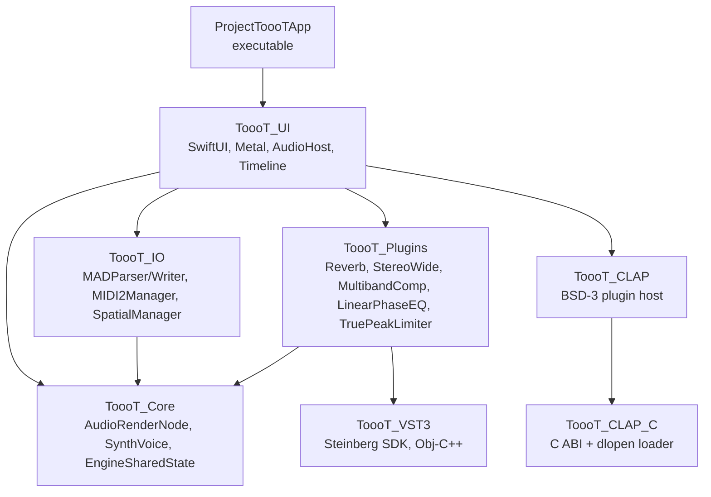
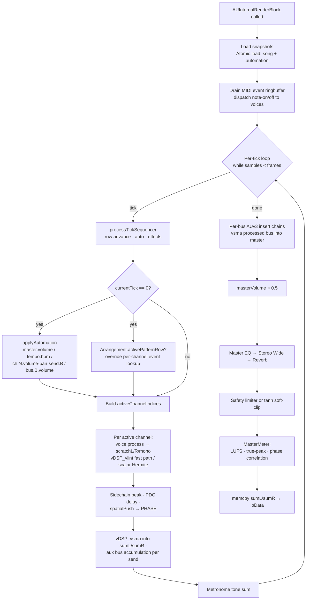
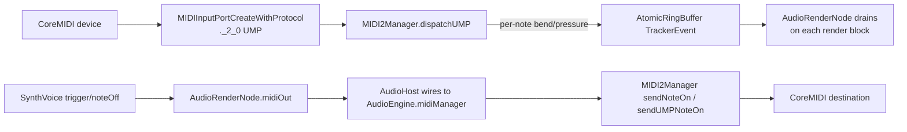
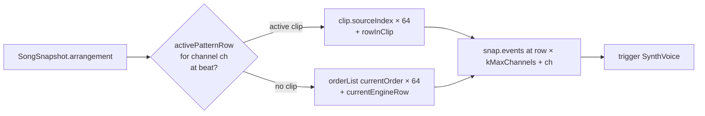
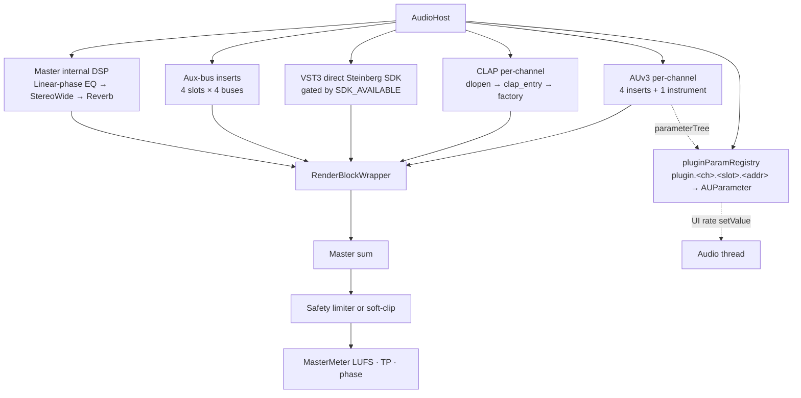
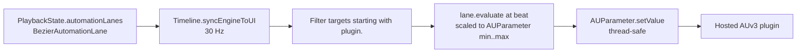

# ToooT Architecture

## Module graph



| Module | Role |
|---|---|
| `ToooT_Core` | Zero-allocation render loop: `AudioRenderNode`, `SynthVoice`, `RenderResources`, two atomic snapshot bridges (`SongSnapshot` + `AutomationSnapshot`), `EngineSharedState`, `AtomicRingBuffer`, `UnifiedSampleBank`, `MasterMeter` (LUFS / true-peak / phase correlation), `MusicTheory`, `Arpeggiator`, `Arrangement` (model + render-path consumption), `SessionGrid`, `Automation`, `Scenes`, `Markers` + `TimingMap`, `RecordingTake` + `TakeLane`, `Fuzzer`, `StabilityMonitor`. |
| `ToooT_IO` | Parsers / writers (`MADParser`, `MADWriter`, `FormatTranspiler`), `MIDI2Manager` (UMP in+out, MPE dispatch, clock), `SpatialManager` (PHASE), `MADMetadataReader` + `MADThumbnail` (Quick Look / Spotlight extractors — pure Foundation + CoreGraphics). |
| `ToooT_Plugins` | Bundled DSP units: `ReverbPlugin`, `StereoWidePlugin`, `TruePeakLimiter`, `MultibandCompressor`, `LinearPhaseEQ`, `MasteringExport`, `AUv3HostManager` (now lazy-scan via `discoverPluginsAsync`), `OfflineDSP` + `GPU_DSP`. |
| `ToooT_VST3` | Obj-C++ bridge that links directly against Steinberg's VST3 SDK. Gated behind `TOOOT_VST3_SDK_AVAILABLE`. |
| `ToooT_CLAP` / `ToooT_CLAP_C` | BSD-3-Clause CLAP host. `_C` carries the minimal ABI header + dlopen loader; the Swift side does discovery + instance management. |
| `ToooT_UI` | SwiftUI workbench, Metal pattern grid (120 Hz), Piano Roll with CC lanes, arrangement + session views, three-pane automation editor, spatial editor (Canvas, no Mesh shaders), generative panel, JIT shell, command palette (⌘K), undo-history browser, crash-recovery sheet, video sync, `AudioHost` (engine wiring + AUv3 parameter registry + plugin-state save/load), `Timeline` (30 Hz MainActor sync + plugin-param automation tick). |
| `ProjectToooTApp` | App entry, multi-window scene, MenuBarExtra screen recorder, AppIntents (`OpenToooTProjectIntent`, `OpenLastAutosaveIntent`, `NewToooTProjectIntent`) + `ToooTShortcutsProvider`. |

## Thread model

Three threads are load-bearing:

| Thread | Actor / isolation | Rules |
|---|---|---|
| Audio I/O (CoreAudio) | `nonisolated` — entered via `renderBlock` | No heap allocation, no locking, no Swift ARC traffic, no `@MainActor` calls. Reads snapshot via a single `Atomic<UInt>` exchange. |
| UI | `@MainActor` | Never dereferences audio-thread pointers directly. Reads playback state via `EngineSharedState` snapshot fields written by the render thread (naturally atomic on arm64 aligned word stores). |
| Background | default actor | MIDI clock timer (`DispatchSource.userInteractive`), recording tap drain, async export, autosave. |

The single legal write path from UI to engine is `AudioRenderNode.swapSnapshot(_:SongSnapshot)`, which performs an atomic pointer exchange and queues the old snapshot for main-thread deallocation via `processDeallocations`.

## Render pipeline (per audio buffer)



`RenderBlockWrapper` (in `AudioHost.swift`) wraps `renderBlock` with per-channel AUv3 insert chains (4 per channel + 1 instrument slot), per-bus AUv3 insert chains (4 per bus), then the master internal-DSP chain (Linear-phase EQ → Stereo Wide → Reverb), then the safety limiter. Gates are: `state.isMasterEQEnabled` / `isStereoWideEnabled` / `isReverbEnabled` / `isMasterLimiterEnabled`.

## Snapshot lifecycle

Two parallel atomic snapshots ride the same pattern:

- **`SongSnapshot`** — events, instruments, order list, song length, envelope flags, optional `Arrangement`. Raw-pointer-heavy value type wrapped by `SnapshotBox` so `Unmanaged` retain / release works. `_snapshotPtr: Atomic<UInt>` holds the bitPattern of the current box.
- **`AutomationSnapshot`** — final class holding `[String: AutomationLane]`. Built by `Timeline.publishSnapshot` from `PlaybackState.automationLanes` (UI-side `BezierAutomationLane` values converted inline). `_automationPtr: Atomic<UInt>` is its sibling.

Both ring buffers — `deallocationQueue` (capacity 2048) and `automationDealloc` (capacity 2048) — drain only on the MainActor via `processDeallocations`. The 2048-slot capacity is sized to absorb realistic main-thread bursts (UI drag at 60 Hz between 30 Hz Timeline drains accumulates ~2 entries; project load is a handful) with multiple orders of magnitude of headroom.

```mermaid
sequenceDiagram
    participant UI as UI thread
    participant SongAtom as _snapshotPtr<br/>(Atomic&lt;UInt&gt;)
    participant AutoAtom as _automationPtr<br/>(Atomic&lt;UInt&gt;)
    participant SongQ as deallocationQueue<br/>(2048 slots)
    participant AutoQ as automationDealloc<br/>(2048 slots)
    participant Audio as Audio thread

    UI->>UI: PlaybackState changed
    UI->>UI: Build SongSnapshot · AutomationSnapshot
    UI->>SongAtom: exchange(new song raw)
    SongAtom-->>UI: old raw
    UI->>SongQ: push(old)
    UI->>AutoAtom: exchange(new auto raw)
    AutoAtom-->>UI: old raw
    UI->>AutoQ: push(old)

    Audio->>SongAtom: load(acquire)
    Audio->>AutoAtom: load(acquire)
    Audio->>Audio: retain song · use · release
    Audio->>Audio: takeUnretainedValue auto · iterate lanes

    UI->>SongQ: processDeallocations
    UI->>AutoQ: processDeallocations
```

## Memory ownership

- `UnifiedSampleBank` owns one giant PCM slab (256 MiB default). Samples have no per-region retain count; `SampleRegion.offset+length` indexes the slab.
- `RenderResources` owns all render-thread scratch buffers (per-channel delay, voices, mixing sums, envelope scratch, per-thread voice scratch pool for the concurrent offline render). Allocated once, lives for the life of `AudioEngine`.
- `EngineSharedState` is a plain C struct of `Int32` / `Float`. The only cross-thread state. All writes from UI must go through `Atomic<T>` wrappers in the `Synchronization` framework.

## MIDI routing



The MIDI clock (`0xF8`, 24 ppqn) is driven by a `DispatchSource.userInteractive` timer in `MIDI2Manager.startClock(bpm:)`, not by the audio thread.

## PHASE spatial path

`AudioRenderNode.spatialPush` is invoked for channels 0–31 on every buffer with a mono sum of the channel's output. `AudioHost` routes this to `SpatialManager.pushAudio(channel:buffer:frames:)`, which copies into a pre-allocated `AVAudioPCMBuffer` pool and calls `PHASEPushStreamNode.scheduleBuffer`. PHASE applies the spatial mix and writes back to the system output — this is a parallel path, not in-line with the render bus.

Positions are stored on `PlaybackState.channelPositions: [Int: SIMD3<Float>]` (metres in PHASE world space) and updated from the UI via `SpatialManager.updateVoicePosition(channel:x:y:z:)`. The PHASE engine runs in `.automatic` update mode on its own scheduler.

The spatial editor (`MetalSpatialView`) is a pure SwiftUI Canvas top-down view: listener glyph at center, draggable channel dots distributed around them at 2 m default radius (so first-launch users see populated content). Earlier Mesh-shader pipeline was abandoned — it required Apple GPU family 7+ (silently failed on base M1) and rendered as a black screen.

## Arrangement consumption

`SongSnapshot.arrangement: Arrangement?` is the optional handle. When non-nil, `processTickSequencer`'s per-channel event lookup defers to `Arrangement.activePatternRow(forChannel:atBeat:)` — if a pattern clip is active for the channel's `channelIndex`, the engine reads events from that clip's source pattern at the correct row offset. Channels with no active clip fall through to classic order-list pattern-grid playback, so existing tracker projects play unchanged.



Tracker convention: 4 rows = 1 beat, 64 rows = 1 pattern, 16 beats per pattern. Beats inside a clip wrap modulo 64 so long clips loop their source pattern. Honors `track.muted` / `track.soloed` (any soloed track makes others fall silent).

Audio (`.audio`) and MIDI (`.midi`) clip kinds are still pending — pattern clips are the v1.

## Plugin hosting



- **AUv3 inserts**: `AudioHost.loadPlugin(component:for:)` instantiates an `AUAudioUnit`, takes its `internalRenderBlock`, stores it in `RenderBlockWrapper.pluginBlocks[ch*4 + slot]`. Up to 4 inserts per channel + 1 instrument. The per-channel loop in `coreAudioRenderCallback` walks these in order. Every loaded plugin's `parameterTree.allParameters` is auto-registered into `pluginParamRegistry` under `plugin.<channel>.<slot>.<address>`.
- **Bus inserts**: Same pattern but on bus outputs — `busInsertBlocks[bus * 4 + slot]`. Bus buffers are wrapped in pre-allocated `AudioBufferList`s (mData points at `res.busL[b]` / `res.busR[b]` — stable for the lifetime of `RenderResources`). Registered under `plugin.bus.<bus>.<slot>.<address>`.
- **Master internal DSP**: `LinearPhaseEQ`, `StereoWidePlugin`, `ReverbPlugin` are `ToooTBaseEffect` subclasses kept alive on `AudioHost`. Their render blocks are gated by `state.isMasterEQEnabled` / `isStereoWideEnabled` / `isReverbEnabled` and run in that order on the master sum.
- **Mastering AUv3 effects**: `TruePeakLimiter`, `MultibandCompressor` are also `ToooTBaseEffect` subclasses available as channel/bus inserts.
- **CLAP**: `CLAPHostManager` enumerates `.clap` bundles; `CLAPPluginInstance` manages lifecycle (`init` → `activate` → `start_processing` → `process` → `stop_processing` → `deactivate` → `destroy`).
- **VST3**: `VST3Host` gates everything behind `TOOOT_VST3_SDK_AVAILABLE`. Without the SDK, `loadPluginAtPath:` fails, `sdkAvailable` returns `NO`, and `AudioHost.loadVST3Plugin` refuses to install the render block — guaranteeing a stub VST3 never silently replaces a working AUv3 instrument.

### Plugin parameter automation



Native engine targets (`master.volume` / `tempo.bpm` / `ch.N.{volume,pan,send.B}` / `bus.B.volume`) are evaluated on the audio thread by `AudioRenderNode.applyAutomation` at every row boundary. Plugin parameters live at UI rate because `AUParameter.setValue` is thread-safe and walking a Swift `Dictionary` on the audio thread isn't.

## File format

`.mad` is a chunked little-endian file:

| Offset | Size | Content |
|---|---|---|
| 0 | 4 | `MADK` / `MADG` / `Tooo` signature |
| 4 | 32 | Song title (ASCII, zero-padded) |
| 296 | 1 | `numPatterns` |
| 297 | 1 | `numChannels` |
| 299 | 1 | `numInstruments` |
| 302 | 999 | Order list (UInt8 per position) |
| 1301 | `numPat * 64 * numChn * 5` | Pattern cells (note, inst, vol, effect, param) |
| after patterns | `numInstruments * 232` | Instrument headers |
| after headers | variable | Int16 PCM sample data |
| after samples | optional | `TOOO` chunk: `[4b tag][4b LE len][JSON merged blob]` |

The `TOOO` chunk merges everything that doesn't fit into the linear pattern + sample layout:

| Key | Producer | Contents |
|---|---|---|
| plugin states | `AudioHost.getPluginStates` | Per-AUv3 / VST3 / CLAP fullState as base64 |
| `arrangement` | `Arrangement.exportAsPluginStateData` | Tracks, clips (start/duration/fade/gain/source), bpm, time-sig, loop |
| `sessionGrid` | `SessionGrid.exportAsPluginStateData` | Cells with clip references |
| `automation` | `AutomationBank.exportAsPluginStateData` | Lanes by targetID |
| `scenes` | `SceneBank.exportAsPluginStateData` | Mixer state snapshots |
| `timingMap` | `TimingMap.exportAsPluginStateData` | Markers + time-signature changes |
| ccLanes (MIDI CC) | `PlaybackState.ccLanes` merge | Per-pattern/channel/CC value maps |

Instrument header (232 bytes): 32-byte name, sample length (LE 32-bit), loop start/length, finetune nibble at byte 24 (MOD-compatible) and byte 44 (MAD-extended, two's complement), stereo flag, loop type.

## Invariants (never violate)

See `memory/lessons_learned.md` for L21–L35. Short version: UI never writes BPM during playback; playhead reads `sharedState.playheadPosition` only; oscillating effects never mutate base properties; `masterVol = 0.5` in both render paths; `vDSP_vlint` OOB guard = `(N-1)/F`; shared `processTickSequencer` for realtime + offline; waveform correlation ≥ 0.99 is the test-pass bar (not mere non-silence).
