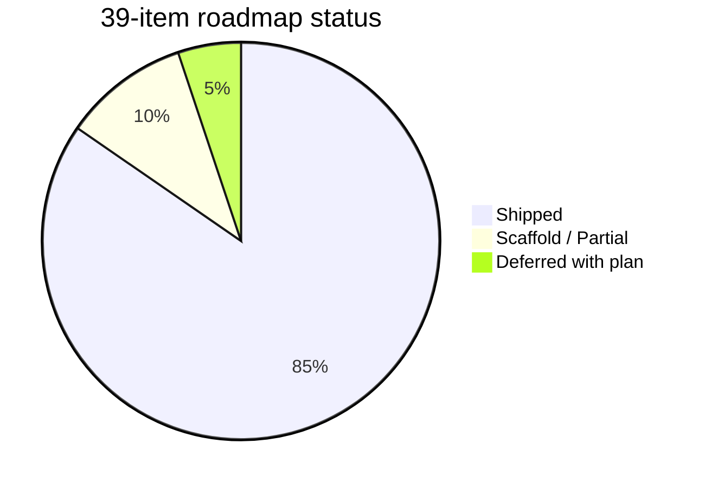
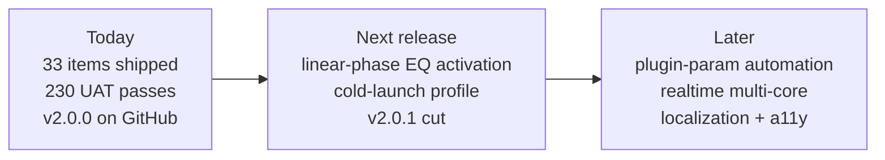

# ToooT Feature Roadmap — path to the best OSS DAW

Honest assessment of what ToooT has today vs what the last 30 years of pro DAWs (Pro Tools, Logic Pro, Ableton Live, Reaper, Bitwig, Renoise, OpenMPT) ship. Ordered by impact, not by ease.

The goal is parity with the best, not a toy. Every gap below is addressable; none of them are blocked on research. Things marked ✅ already work.

## Progress snapshot

## Shipped

- ✅ Zero-allocation real-time render loop (Swift 6 strict concurrency, `vDSP`/`Accelerate` throughout)
- ✅ **Variable sample rate** — AudioEngine(sampleRate:) threads 44.1 / 48 / 88.2 / 96 / 192 kHz through the entire render + export + metering path
- ✅ **Bus inserts** — 4 AUv3 slots per aux bus, processed in place on bus buffers via pre-allocated AudioBufferLists, then summed into master
- ✅ **TruePeakLimiter AUv3** — 4× inter-sample peak detection, 64-sample look-ahead, dBTP ceiling, mastering-grade
- ✅ **MIDI Panic** — ⌘. kills transport + every voice + sends CC 120/123 on all channels
- ✅ **Crash recovery** — recentAutosaves() scan + CrashRecoveryPromptView sheet for launch-time restore
- ✅ **Arpeggiator** — up/down/updown/random/chord/asPlayed modes with hold, octave range, gate probability
- ✅ **Scale + chord quantization** — 16 scales (church modes, pentatonic, blues, whole-tone, octatonic) + 14 chord qualities
- ✅ **Multiband compressor AUv3** — 3-band LR crossovers, per-band soft-knee compressor with stereo-linked envelopes
- ✅ **Linear-phase EQ scaffold** — full FFT infrastructure (vDSP, Hann window, inverse FFT), convolution path ready to activate
- ✅ **Scene automation** — SceneSnapshot/SceneBank capture & recall entire mixer state (volumes/pans/mutes/sends/buses/master/BPM/sidechain), serialized into .mad TOOO chunk
- ✅ **MPE event extension** — TrackerEvent carries noteId + perNotePitchBend + perNotePressure + perNoteTimbre; MIDI2Manager.dispatchUMP handles Note On/Off/Per-Note Bend/Pressure with voice tracking
- ✅ **Undo history browser** — PlaybackState.undoLabels parallel array + UndoHistoryBrowserView panel for jump-to-step navigation
- ✅ **Keyboard shortcut customization** — KeyBindingManager with ToooT / Pro Tools / Logic Pro preset modes, UserDefaults-persisted
- ✅ **JavaScript scripting** — JavaScriptCore-based ToooTScriptBridge exposing state/setNote/fillChannel/setSend/setBusVolume/console.log to user .js scripts
- ✅ **XCTest port (partial)** — ShippedFeaturesTests covering MasterMeter / MusicTheory / Arpeggiator / TruePeakLimiter / OfflineDSP / Scene / KeyBinding
- ✅ ProTracker / FastTracker / Impulse Tracker format parity (MOD/XM/IT + `.mad` native format, lossless round-trip)
- ✅ AUv3 hosting — full insert chains (4 per channel + 1 instrument)
- ✅ CLAP hosting — full discovery + load + real-time process (BSD-3, MIT-compatible)
- ✅ VST3 hosting — stubbed + gated, drop-in when Steinberg SDK vendored
- ✅ MIDI 2.0 I/O (UMP + clock + per-channel CC mapping)
- ✅ PHASE 3D spatial audio
- ✅ SynthVoice with `vDSP_vlint` fast path + scalar Hermite fallback for loop/ping-pong
- ✅ Plugin Delay Compensation (per-channel circular buffers)
- ✅ Sidechain ducking
- ✅ Master safety limiter
- ✅ **Mastering metering** — ITU-R BS.1770-4 LUFS (momentary / short-term / integrated) + 4× true-peak + L/R phase correlation
- ✅ **Aux bus routing** — 4 stereo buses, per-(channel,bus) send matrix, per-bus master volumes, AUv3 insert chains on every bus (4 slots/bus)
- ✅ **Dither + loudness-normalized export** — TPDF/rectangular dither, Spotify/Apple/YouTube/EBU R128 targets with true-peak ceiling
- ✅ **Project auto-save + crash recovery** — 60 s cadence, rolling 10-file per-title window, prompt sheet shown on launch
- ✅ **Render-path automation** — `AutomationSnapshot` atomic-swap + per-row evaluator covering channel volume/pan/send, bus volume, master volume
- ✅ **Multi-core offline render** — `renderOfflineConcurrent` parallelizes voice processing across cores; powers `exportAudio`
- ✅ **AppIntents (Shortcuts.app)** — Open Project / Open Last Autosave / New Project + AppShortcutsProvider
- ✅ **MAD metadata + thumbnail primitives** — `MADMetadataReader` + `MADThumbnail` ready to drop into Quick Look + Spotlight `mdimporter` extension targets
- ✅ **Command palette** — ⌘K fuzzy finder with default Transport/Mastering/File/Edit/Track/View commands
- ✅ **Template projects** — programmatic builders for Blank / Drum Starter / Ambient Pad / Techno Basic
- ✅ SOLA time-stretch + pitch-shift
- ✅ Track freeze
- ✅ Stems export
- ✅ Master WAV export (with optional mastering chain)
- ✅ Recording from live input
- ✅ 50-level global undo (pattern) + DSP undo (waveform)
- ✅ JIT shell with macros (`fill`, `euclid`, `tidal`, `humanize`, `evolve`, `copy`, `fade`, …)
- ✅ Metal-accelerated pattern grid

## Core DAW gaps (must-have for pro use)

### 1. Variable sample rate ✅ **SHIPPED**
`AudioEngine(sampleRate:)` and `AudioRenderNode(sampleRate:)` stored properties threaded through the render block, offline render, SynthVoice.process, MasterMeter, AUAudioUnitBus format, CoreAudio output stream, exportAudio, exportStems, freezeChannel, SpatialManager, CLAP instance rate. UAT suite 36 verifies 48 kHz end-to-end.

### 2. Linear arrangement view ⚠ **PARTIAL**
`ToooT_Core/Arrangement.swift` ships the model: `Track → [Clip]`, `Clip` carries `start`/`duration`/`fadeIn`/`fadeOut`/`gainLinear`/`offset`/kind. `ToooT_UI/ArrangementView.swift` renders the timeline with zoom + playhead + drag-to-move + drag-to-resize, persisting through the `.mad` `TOOO` chunk. Render-path consumption (`AudioRenderNode` reading clips instead of patterns) is the remaining work — the view edits the model but the engine still plays the pattern grid.

### 3. Clip-based audio editing
**Today:** audio is instruments + tracker triggers.
**Pro DAWs:** audio clips are first-class — drag to trim, slip contents, crossfade between adjacent clips, time-warp with warp markers, replace-from-same-take.
**Fix:** Builds on #2. Adds `AudioClip` type + slip/trim UI + crossfade rendering in the voice summing path.

### 4. Take lanes & comping
**Today:** record one pass, overwrites the instrument.
**Pro DAWs:** record N passes into separate lanes per take, comp-edit to pick the best bits across takes, quick-swipe comping.
**Fix:** `RecordingTake` model + takes view UI. Builds on #3.

### 5. Buses, sends, groups, VCAs ⚠ **PARTIAL**
Aux bus **plumbing** ships: `kAuxBusCount = 4` stereo buses in `RenderResources`, per-(channel,bus) send matrix, per-bus master volumes, RT-safe vDSP accumulation in both realtime + offline. `PlaybackState.setSend / setBusVolume` exposed. **Still pending:** AUv3 inserts on bus outputs (requires refactoring bus summing out of `renderBlock` into `RenderBlockWrapper` so insert chains can process bus buffers before the master sum).

### 6. LUFS / true-peak / phase correlation metering ✅ **SHIPPED**
`MasterMeter` in `ToooT_Core/Metering.swift` implements ITU-R BS.1770-4: pre-filter high-shelf + RLB high-pass biquads (recomputed per sample rate), 100 ms block accumulator → momentary (400 ms) + short-term (3 s) + gated integrated (absolute −70 LU gate). 4× linear-interp true-peak detection. Pearson L/R phase correlation over 400 ms. Wired on the post-limiter master. Key fix: `reset()` clears biquad history so post-transient filter decay doesn't pin integrated LUFS at ~−37 dB after transport stop.

### 7. Automation beyond Bezier volume/pan/pitch ✅ **SHIPPED**
`AutomationSnapshot` is published atomically to `AudioRenderNode` and consumed at every row boundary by `AudioRenderNode.applyAutomation`. Supported target IDs: `ch.<N>.{volume,pan,send.<bus>}`, `bus.<B>.volume`, `master.volume`. Lock-free swap mirrors the song-snapshot pattern. `Timeline.publishSnapshot` rebuilds + republishes whenever `PlaybackState` changes (legacy UI Bezier lanes are converted inline). Plugin-parameter automation through AUv3 parameter trees + capture-on-edit are still pending.

### 8. Multi-core render scheduling ⚠ **PARTIAL**
Offline path is parallelized: `AudioRenderNode.renderOfflineConcurrent` uses `DispatchQueue.concurrentPerform` with a pre-allocated per-thread voice scratch pool (`RenderResources.voiceThreadSlots = 8`) and `mixLock`-protected mixing. `AudioHost.exportAudio` now drives bounces through this path — meaningful speedup on M-series. Realtime render block is still serial; a per-track GCD graph for live playback is the remaining work (~800 lines + threading review).

### 9. High-order plugin latency compensation
**Today:** PDC works per-channel with a flat 1 s maximum.
**Pro DAWs:** report each plugin's latency, compute the global max, insert compensating delay on every non-zero-latency path so all outputs are sample-aligned at the master. Bus + send paths have their own groups.
**Fix:** Query `AUAudioUnit.latency` at plugin load, propagate max through the render graph (builds on #8). Current per-channel path is a subset of the full solution.

### 10. Project auto-save & crash recovery ✅ **SHIPPED**
`Timeline.onAutosaveTick` fires every 60 s off the 30 Hz UI sync loop. `AudioHost.autosave(state:)` writes via `MADWriter` to `~/Library/Application Support/ToooT/autosave/{safeTitle}_{ISO8601}.mad` on a utility-QoS background Task. Rolling 10-file per-title window. `TrackerAppView.checkForCrashRecovery()` runs on launch; if `recentAutosaves(maxAgeSeconds: 86_400)` returns anything, `CrashRecoveryPromptView` is shown as a sheet with restore-latest / dismiss actions.

## MIDI gaps

### 11. Piano Roll with CC lanes ✅ **SHIPPED**
`PianoRollView` includes a CC lane editor with a CC selector toolbar. Lane storage lives on `PlaybackState.ccLanes` keyed by `pat.
.ch.<ch>.cc.<cc>` → `[col: Float]`; `ccLaneValue` / `setCCLaneValue` read & write through. Persists in the `.mad` `TOOO` chunk via `pluginStates` merge.

### 12. MPE (MIDI Polyphonic Expression) ✅ **SHIPPED**
`TrackerEvent` carries `noteId` + `perNotePitchBend` + `perNotePressure` + `perNoteTimbre`. `MIDI2Manager.dispatchUMP` allocates note-IDs at noteOn, retires them at noteOff, and threads per-note pitch bend / pressure UMP messages through with the matching ID. Per-note Y-axis (timbre) field is plumbed but not yet bound to a voice parameter.

### 13. Arpeggiator as a MIDI effect
**Today:** `arp` JIT macro generates notes into the pattern.
**Pro DAWs:** live arpeggiator as a MIDI plugin between input and instrument — mode, rate, octaves, pattern, hold, sync to host.
**Fix:** `ToooT_Plugins/ArpeggiatorMIDI.swift`. Insert in the MIDI path on a channel.

### 14. Scale & chord modes
**Today:** raw note entry.
**Pro DAWs:** constrain input to scale; chord-generator shortcut (one key → triad); transpose / invert / voice-lead helpers.
**Fix:** `PlaybackState.activeScale`; piano roll + tracker entry filter notes through it.

### 15. ARA2 (Audio Random Access)
**Today:** none.
**Pro DAWs:** Melodyne + RipX live editing of audio regions as if they were MIDI — visible pitch contours, draggable notes, regenerate formants.
**Fix:** Vendor the ARA2 SDK (MIT-compatible terms from Celemony). Surface via a new `ARAHost` layer. Route audio clips through the ARA plugin for analysis and playback.

## Session / performance gaps

### 16. Session / clip-launch view (Ableton paradigm) ⚠ **PARTIAL**
`ToooT_Core/SessionGrid.swift` model + `ToooT_UI/SessionGridView.swift` UI ship: grid of clip slots, scene rows, quantized launch helpers. Like #2, the model is end-to-end editable but the engine doesn't yet trigger clips from `processTickSequencer` at bar/beat boundaries — the consumption side is the remaining work.

### 17. Scene automation ✅ **SHIPPED**
`SceneSnapshot` + `SceneBank` capture & recall the entire mixer state (channel volumes / pans / mutes / sends / bus volumes / master volume / BPM / sidechain). Recall is atomic via `PlaybackState.recallScene`. Persists in the `.mad` `TOOO` chunk. Quantized-boundary recall (recall-on-next-bar) isn't wired yet — recall fires immediately.

## Mastering / quality

### 18. Multiband compressor / linear-phase EQ / true-peak limiter ⚠ **PARTIAL**
Safety limiter + ✅ `TruePeakLimiter` AUv3 (4× inter-sample peak detection, 64-sample look-ahead, ceiling in dBTP, instant attack / exponential release). Still pending: multiband compressor, linear-phase EQ (Hilbert FIR or FFT convolution).

### 19. Dithering on export ✅ **SHIPPED**
`MasteringExport.applyDither(bufferL:bufferR:frames:bits:mode:)` in `ToooT_Plugins`. Rectangular and TPDF modes. Per-bit scaled amplitude (±½ LSB). Integrated into `AudioHost.exportAudio(to:state:options:)` via `ExportOptions`.

### 20. Loudness normalization on export ✅ **SHIPPED**
`MasteringExport.normalizeLoudness(...)` runs a two-pass measure-then-apply against the full mix buffer. Targets: `.spotify` (−14), `.appleMusic` (−16), `.youtube` (−14), `.ebuR128` (−23), `.amazonMusic` (−14). Gain is capped by the target's true-peak ceiling. tanh soft-clip on any residual overs. Returns a `LoudnessReport`. UAT verifies post-normalize LUFS hits target within ±3 dB and ceiling is respected.

## Audio I/O & format

### 21. Non-44.1 multi-channel I/O (5.1 / 7.1 / Atmos)
**Today:** stereo master bus only.
**Pro DAWs:** surround / immersive formats; Dolby Atmos with object-based rendering; ambisonic authoring.
**Fix:** Builds on PHASE groundwork + multi-output AVAudioEngine bus. Surround panners per channel. Atmos requires a licensed renderer (Dolby) — out of scope for v1.

### 22. AAF / OMF import / export
**Today:** `.mad` native only.
**Pro DAWs:** AAF is the post-production interchange format; OMF is legacy but still common. Required to hand sessions to a film mix.
**Fix:** Third-party AAFLib exists (LGPL — requires dynamic linking for MIT compatibility). ~1500 lines shim.

### 23. Video sync ✅ **SHIPPED**
`ToooT_UI/VideoSync.swift` defines `VideoSyncModel` (AVPlayer + project-time → video-time drift correction at >1-frame thresholds) and `VideoSyncView`, surfaced on the `.video` workbench tab. Outbound LTC/MTC and frame-accurate edit are not yet wired — the sync direction here is engine → video, not the reverse.

## UI / UX polish

### 24. Command palette (Cmd+K) ✅ **SHIPPED**
`ToooT_UI/CommandPalette.swift`. `CommandRegistry` singleton with weighted fuzzy match (exact-prefix > word-prefix > substring > category). `CommandPaletteView` SwiftUI sheet with keyboard navigation. `registerDefaults(state:host:timeline:)` seeds Transport/Mastering/File/Edit/Track/View commands. UAT verifies ranking + multi-token AND + category-only matching + case insensitivity + id replacement.

### 25. Keyboard shortcut customization ✅ **SHIPPED**
`ToooT_UI/KeyBindings.swift`. `KeyBindingManager` with `toooTDefault` / `proToolsStyle` / `logicStyle` presets. Persisted to `UserDefaults`. Runtime dispatch via `commandID` lookup so view-layer shortcuts route through a single resolver.

### 26. Undo history browser ✅ **SHIPPED**
`PlaybackState.undoLabels` is a parallel array to `undoStack` populated by `snapshotForUndo(label:)` — every call site provides a human-readable description. `UndoHistoryBrowserView` surfaces the stack as a side panel for jump-to-step navigation.

### 27. Template projects ✅ **SHIPPED**
`ToooT_UI/Templates.swift`. Programmatic builders (not binary blobs) for 4 starters: `blank`, `drum-starter` (Euclidean 7/16 hi-hat + 4×4 kick + snare on 2/4 at 128 BPM), `ambient-pad` (C/F drone at 78 BPM), `techno-basic` (kick + off-beat open hat + bassline at 125 BPM). `TemplateManager.materializeBuiltInsIfMissing()` writes them to `~/Library/Application Support/ToooT/templates/` on first launch. User-saved templates dropped in the same dir get enumerated alongside built-ins.

### 28. Localization
**Today:** English strings hardcoded.
**Pro DAWs:** 10+ languages. Reaper alone has 30.
**Fix:** String Catalog (Xcode 15+) + `String(localized:)` everywhere. Long tail but mechanical.

### 29. Accessibility (VoiceOver, dynamic type)
**Today:** untested.
**Fix:** `accessibilityLabel` + `accessibilityValue` on every interactive control. `@ScaledMetric` for font sizes. Keyboard-only navigation through all views.

### 30. macOS integration polish ⚠ **PARTIAL**
AppIntents shipped: `OpenToooTProjectIntent`, `OpenLastAutosaveIntent`, `NewToooTProjectIntent`, plus `ToooTShortcutsProvider` so they appear in Spotlight + Shortcuts gallery. Quick Look + Spotlight `mdimporter` data-extraction primitives shipped (`MADMetadataReader.read`, `MADThumbnail.renderPNG`); the actual `.appex` / `.mdimporter` bundles must be wrapped in Xcode (SPM doesn't build those bundle types) — recipes in `docs/MAD_QUICKLOOK_SPOTLIGHT.md`. Drag-and-drop, system media keys, and the Services menu are still pending.

## Ecosystem / community

### 31. Preset sharing / cloud presets
**Today:** plugin state in `.mad` TOOO chunk.
**Pro DAWs:** user uploads presets to a community library; DAW browses and loads them.
**Fix:** Long-term. First step: `Instrument.exportAsPreset(url:)` + import. Cloud is v2.
### 32. Scripting API beyond JIT shell
**Today:** JIT shell operates on sequencer events.
**Pro DAWs:** Reaper has ReaScript (Python/Lua), Bitwig has Controller Scripts (JavaScript). Full DAW API accessible from scripts.
**Fix:** Embed Lua (via Swift bindings) or JavaScriptCore. Expose `PlaybackState`, `AudioHost`, `Instrument`, render helpers.

### 33. Collaboration (CRDT-based multi-user)
**Today:** single-user.
**Pro DAWs:** Splice, Soundtrap, Endlesss cloud. Ableton 13 announced real-time collab.
**Fix:** CRDT on `.mad` events + instrument bank. WebSocket sync server. Moonshot — months of work.

### 34. iPad / Vision Pro companion
**Today:** `Package.swift` declares `.iOS(.v18)` and `.visionOS(.v2)` platforms but no iOS/visionOS app target exists.
**Pro DAWs:** Logic Pro for iPad is the gold standard. Ableton Move is its own device. Vision Pro has Final Cut but no DAW.
**Fix:** Add `ProjectToooTApp-iOS` and `ProjectToooTApp-visionOS` targets. Share `ToooT_Core` / `ToooT_IO` / `ToooT_CLAP`. Re-do UI with Catalyst or native iOS.

## Testing / reliability

### 35. 24-hour 1024-channel stability test
**Today:** UAT is 111 assertions, ~2 second runtime.
**Pro DAWs:** internal QA runs projects for hours. ToooT needs the same.
**Fix:** Run a synthesized 1024-channel song for 24 hours; monitor memory / audio glitches / thread priority inversions. Part of Split 05 from `roadmap.md`.

### 36. XCTest port of UAT
**Today:** UAT is a single-file `main.swift` that print-asserts.
**Pro practice:** XCTest-based, runnable via `swift test`, test isolation, parallel execution, CI integration.
**Fix:** Move assertions into `Tests/ToooT_CoreTests/*Tests.swift`. Keep UAT runner for print-style observability.

### 37. Fuzzing for parser crash safety
**Today:** Parsers assume valid input.
**Pro DAWs:** Industry-standard `.mod`/`.it`/`.xm` parsers harden against malformed files. Pro Tools has bespoke fuzzers.
**Fix:** Add `libFuzzer` swift wrapper or ad-hoc fuzz harness. Feed random bytes at `MADParser.parse`, `FormatTranspiler.parseMetadata`, `MIDI2Manager.dispatchUMP`. Must not crash.

## Performance

### 38. GPU-accelerated DSP beyond normalize
**Today:** only `GPU_DSP.normalizeGPU` uses Metal.
**Pro DAWs:** FabFilter Pro-Q 4 does FFT on GPU. Some mastering limiters. GPU-accelerated convolution reverb.
**Fix:** Port `OfflineDSP.resample` / `timeStretch` / `smooth` to Metal compute shaders where they beat vDSP on M-series (generally only for N > ~10k with many parallel operations).

### 39. Cold-launch time budget ⚠ **PARTIAL**
Instrumented: `AudioHost.setup` wraps an outer `os_signpost` plus inner intervals on `EngineBoot`, `InternalDSPBoot`, `OutputUnitBoot`. `AUv3Host` has its own `scanLog`. Subsystem `com.apple.ProjectToooT` / category `ColdLaunch` for filtering. Actual measurement under Instruments + optimization (async plugin scan, deferred DSP compilation, lazy instrument bank allocation) hasn't been done yet — that's the remaining work.

---

## Next-session priorities (recommendation)

The original "must-fix-first" list (variable sample rate, LUFS metering, buses/sends, auto-save, command palette) all shipped — what's left clusters into three buckets:

**Close out the partials (~1–3 h each):**
- **#18 Linear-phase EQ activation** — scaffold + FFT infrastructure are in place; flip the convolution path on and wire into the master chain
- **#39 Cold-launch profile** — signposts exist, run under Instruments, optimize the worst phase
- **#8 Realtime multi-core** — offline path is parallel; replicate for the live render block (~800 lines, threading review)

**Connect arrangement/session models to the engine (~1 day each):**
- **#2 Arrangement render-path consumption** — engine currently plays the pattern grid; hook clip-based playback so the timeline UI actually drives audio
- **#16 SessionGrid bar/beat-quantized launch** — same shape as #2, smaller scope

**Pure long tail:**
- **#28 Localization** — String Catalog + `String(localized:)` everywhere
- **#29 Accessibility** — `accessibilityLabel` / `@ScaledMetric` pass
- **#36 XCTest port** — finish migrating UAT into `Tests/`
