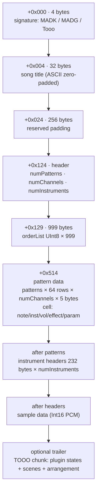
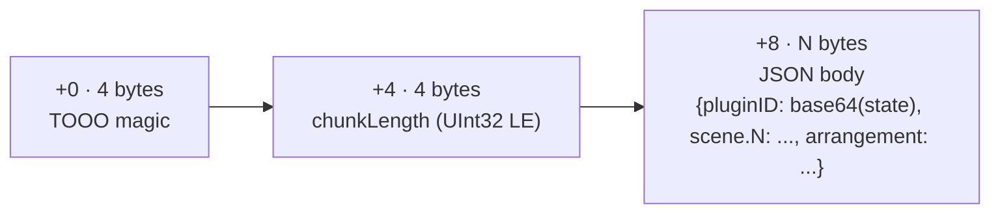

# `.mad` file format

Native ToooT project file. All multi-byte values are little-endian.

## Top-level layout

## Pattern cell

| Byte | Meaning |
|---|---|
| 0 | Note: `0` = empty, `1..127` = MIDI note, `0xFE` = note off |
| 1 | Instrument (1-indexed) |
| 2 | Volume: `0..64` → velocity, `0xFF` = no change |
| 3 | Effect command |
| 4 | Effect parameter |

Notes are encoded as MIDI numbers (A4 = 69). On load, frequency is derived as `440 * 2 ^ ((note - 69) / 12)`.

## Instrument header (232 bytes)

| Offset | Size | Content |
|---|---|---|
| 0 | 32 | Name (ASCII) |
| 32 | 4 | Sample length in frames (UInt32 LE) |
| 36 | 4 | Loop start (UInt32 LE) |
| 40 | 4 | Loop length (UInt32 LE) |
| 44 | 1 | Finetune nibble (MAD extended — two's complement `-8..+7` in low nibble) |
| 46 | 1 | Stereo flag (`0` mono, `1` stereo interleaved) |
| 47 | 1 | Loop type (`0` none, `1` classic, `2` ping-pong) |
| 24 | 1 | Finetune nibble (MOD-compatible duplicate — for round-trip fidelity against ProTracker tools) |

The finetune nibble is written to **both** offset 44 and offset 24. Parsers prefer offset 44 and fall back to 24 (see `MADParser.parseMAD` L98–99). The duplication preserves ProTracker compatibility while allowing forward-compatible finetune precision (lesson L29).

## Sample data

Samples are packed back-to-back in the order their instruments are written. For each instrument with `sampleLength > 0`:
- mono: `sampleLength * 2` bytes (Int16 PCM)
- stereo: `sampleLength * 4` bytes (interleaved L/R Int16 PCM)

Conversion to the engine's `Float32` representation uses `vDSP_vflt16` + `vDSP_vsmul(scale=1/32767)` on load and the inverse on write.

## Optional plugin-state trailer

After the last sample, an optional chunk may appear:

Plugin IDs are `channelIndex_slotIndex` (AUv3 inserts), `channelIndex_inst` (instrument slot), or the reserved keys `StereoWide` / `ProReverb` for global inserts. Bodies are `PropertyListSerialization` XML plists, base64-encoded.

## Lossless round-trip

`MADWriter` → `MADParser` is byte-for-byte lossless for:
- song title
- pattern data (all cells including effect command+param)
- instrument name, sample length, loop info, finetune, stereo flag, loop type
- PCM data within the 16-bit dynamic range
- AUv3 plugin state blobs

UAT suite 18 (`MAD Write/Read Roundtrip`) enforces this on every CI run.
