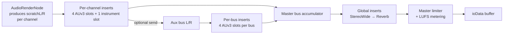

# Plugin hosting in ToooT

ToooT supports four plugin surfaces on macOS, ranked by completeness and licensing fit:

| Surface | Status | License | Module |
|---|---|---|---|
| AUv3 (effects + instruments) | ✅ Full — per-channel insert chains, 4 inserts + 1 instrument per channel, state save/load | Apple system API | `ToooT_Plugins` + `ToooT_UI/AudioHost.swift` |
| Bundled vDSP effects (StereoWide, Reverb) | ✅ Full — always available as global inserts | MIT | `ToooT_Plugins` |
| CLAP (CLever Audio Plugin) | ✅ Discovery + load + realtime process wired end-to-end | BSD-3-Clause (MIT-compatible) | `ToooT_CLAP` + `ToooT_CLAP_C` |
| VST3 via direct Steinberg SDK | ⚠ Stubbed (SDK not vendored) — discovery works, load fails with a clear error | Proprietary (free to registered VST devs) | `ToooT_VST3` |

JUCE has been removed entirely — its GPL/commercial dual-license is incompatible with ToooT's MIT core, and we don't need JUCE's cross-platform abstractions on macOS-native code.

## Plugin signal path



The same `AUInternalRenderBlock` interface covers AUv3 natives, the CLAP shim (wrapped as an AU block), and the VST3 bridge (when SDK is vendored). All paths are byte-compatible — swap plugins between channels without hitting new code paths.

## AUv3

### Discovery

`AUv3HostManager.discoverPlugins()` wraps `AVAudioUnitComponentManager` and returns effects + instruments in a single list. The Pro Browser UI in `PluginDialogs.swift` filters by type and manufacturer.

### Loading

```swift
try await audioHost.loadPlugin(component: componentDesc, for: channelIndex)
```

This instantiates the plugin, allocates its render resources, and installs its `internalRenderBlock` into `RenderBlockWrapper` — either into the channel's instrument slot (when `componentType == kAudioUnitType_MusicDevice`) or into the next free insert slot (0..3).

### State persistence

`AudioHost.getPluginStates()` walks all loaded plugins and serializes `fullStateForDocument` as an XML plist, base64-encoded. `MADWriter` embeds this in the `TOOO` chunk. On load, `AudioHost.setPluginStates(_:)` restores state after `loadPlugin` has instantiated the unit.

### Per-channel limits

- 4 insert effects per channel (`RenderBlockWrapper.pluginBlocks[ch*4 + n]`)
- 1 instrument per channel (`RenderBlockWrapper.instrumentBlocks[ch]`)

Loading a 5th insert on a channel is a no-op. Loading a second instrument replaces the first.

## CLAP

**CLAP** ([cleveraudio.org](https://cleveraudio.org)) is a modern, BSD-3-Clause-licensed plugin format designed from the ground up for real-time safety. It is MIT-compatible and has no licensing gate.

### Why we ship it

- Permissive license — no JUCE-style GPL contamination, no Steinberg registration.
- Real-time safe ABI — no locks, no allocations in the render callback, ring-buffer event delivery.
- Commercial vendor adoption: u-he (Diva, Repro, Bazille, Hive), FabFilter (Pro-Q, Pro-C, Saturn), Arturia (Pigments, V Collection), Surge XT, Vital, Dexed, TAL-NoiseMaker.
- Host adoption: Bitwig, Reaper, Ardour, FL Studio, Studio One, Waveform, MuLab.

### Discovery + load

```swift
let clap = CLAPHostManager()             // scans /Library/Audio/Plug-Ins/CLAP + ~/...
let info = clap.availablePlugins.first!
audioHost.loadCLAPPlugin(info: info, for: channelIndex)
```

Under the hood: `tooot_clap_bundle_open` dlopens the bundle's macOS executable, resolves the `clap_entry` symbol, queries the factory via `CLAP_PLUGIN_FACTORY_ID`, and `create_plugin` gives us a `clap_plugin_t *`. `init` + `activate(sr, minFrames, maxFrames)` + `start_processing` get us to a ready-to-render plugin. The channel's instrument slot receives a render block that calls `plugin.process()` with `clap_audio_buffer_t` views of ToooT's L/R render buffers.

### Vendoring the full SDK

`Sources/ToooT_CLAP_C/include/clap_min.h` is a minimal BSD-3 subset vendored to avoid a git submodule. If you want the full CLAP 1.2+ spec (extensions for params, presets, MIDI 2.0, draft interfaces):

```bash
git submodule add https://github.com/free-audio/clap Sources/ToooT_CLAP_C/clap-sdk
```

Then point `cSettings: [.headerSearchPath("clap-sdk/include")]` in `Package.swift` and delete `clap_min.h`. The vendored subset matches upstream struct layouts, so no Swift code changes needed.

## VST3

`VST3Host` is an Obj-C++ bridge that links **directly against the Steinberg VST3 SDK** — no JUCE. It gates on `TOOOT_VST3_SDK_AVAILABLE` at compile time:

| SDK available | `+sdkAvailable` | `loadPluginAtPath:error:` | Behaviour |
|---|---|---|---|
| No (default) | `NO` | Returns `NO`, sets error | Plugin is inert, render block is never installed |
| Yes (SDK vendored) | `YES` | Runs real VST3::Hosting path | Plugin loads and processes audio |

The bridge refuses to wire the audio path unless `sdkAvailable && isLoaded`, so a failed VST3 load cannot replace a working AUv3 instrument slot with an inert passthrough.

### Licensing

Steinberg's VST3 SDK is **dual-licensed**: GPLv3, or the **Steinberg VST 3 SDK License Agreement** (proprietary). The proprietary license is **free to registered VST developers** — the same path Bitwig, Renoise, and plenty of closed-source hosts take. Register at [steinberg.net/developers](https://www.steinberg.net/developers/) to get a VST developer ID, then accept the SDK License Agreement.

Because ToooT is MIT-licensed, linking the SDK under its GPL option would require re-licensing the linking module as GPL. We take the proprietary path instead: the SDK is linked under Steinberg's free developer license, and `ToooT_VST3/` stays MIT on our side.

### Enabling VST3

1. Register at Steinberg and download the VST3 SDK.
2. Vendor into `Sources/ToooT_VST3/VST3_SDK/` (matches `Package.swift` header search path).
3. Add `-DTOOOT_VST3_SDK_AVAILABLE=1` to the target's `cxxSettings`.
4. Replace the `TOOOT_VST3_SDK_ACTIVE` blocks in `VST3Host.mm` with actual `VST3::Hosting::Module::create` / `IAudioProcessor::process` calls.

Until then, CLAP and AUv3 cover every modern commercial plugin vendor meanwhile: every major VST3 ships an AU build too, and the CLAP ecosystem is the fastest-growing plugin format among vendors who care about real-time safety.

## Licensing summary

- **AUv3**: Apple system — no external license required.
- **Bundled vDSP effects**: MIT, part of ToooT's core.
- **CLAP**: BSD-3-Clause. Compatible with MIT. Vendored.
- **VST3**: Steinberg proprietary (free for registered devs). Compatible with MIT when linked under the free developer license. Not vendored.
- **JUCE**: Removed. GPL/commercial dual license would contaminate ToooT's MIT. See Steinberg-direct integration above.
